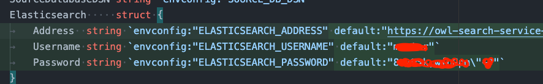

# Testing OSS service

0. update dependency
```
go mod vendor
```

1. run the server in OSS service
```
go run main.go rpc
```
you can update the default values for ES from `Vault` so that you don't have to run server in container, 

or you can update the `.env`

2. once server is up. you can test the call
```
go run main.go
```
- comment/uncomment search function as needed
- add update parameters as needed
- result should match when you run the same query in Kibana

> check ./pkg/storage/es_query@buildBoolFromQuery function comment on how query is build internally